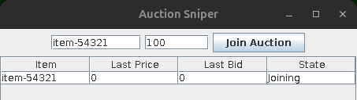
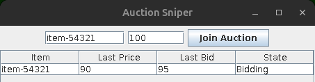
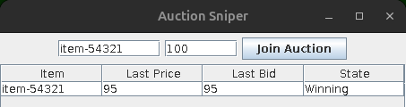
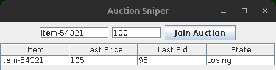
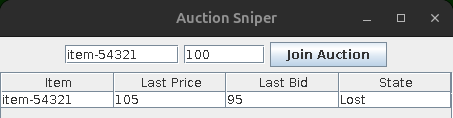

# 在 Docker 裡跑測試

把 unit / integration / end-to-end 測試整套跑起來，不動到主機上的 Java 環境。用 Docker 準備：

- `openfire`：跑 Openfire XMPP server ( `ghcr.io/igniterealtime/openfire` )，測試用的帳號認證都靠它。
- `toolbox`：JDK 8 + Ant + Xvfb 的容器，實際編譯/執行測試。用 `network_mode: service:openfire` 跟 openfire 共用網路，讓容器內的 `localhost` 直接連到 openfire (測試程式碼裡寫死 `XMPP_HOSTNAME = "localhost"`，所以不用改原始碼)。

## 需求

- Docker (需要 sudo 權限)
- Node.js + npm (跑 Playwright 自動化 Openfire setup wizard 用)

## 檔案說明

| 檔案 | 用途 |
| --- | --- |
| `docker-compose.yml` | 定義 `openfire`、`toolbox` 兩個服務 |
| `toolbox.Dockerfile` | `toolbox` 服務的 image (JDK 8 + Ant + Xvfb) |
| `setup-openfire.js` | Playwright 腳本，自動跑完 Openfire setup wizard，並建立測試需要的 3 個帳號 |
| `scripts/run-tests.sh` | 在 `toolbox` 容器內編譯並執行 unit / integration / end-to-end 三套測試 |
| `scripts/start-env.sh` | 啟動容器、跑 `setup-openfire.js`，把整個環境準備好 |
| `scripts/test.sh` | 呼叫 `scripts/run-tests.sh` 跑測試 |
| `scripts/reset-env.sh` | 砍掉容器、清空 Openfire 資料，重新呼叫 `scripts/start-env.sh` |
| `scripts/run-app.sh` | 在 `toolbox` 容器內編譯並執行 Auction Sniper 這個 Swing app，視窗顯示在主機螢幕上 |
| `tools/FakeAuction.java` | 互動式假拍賣現場，模擬 `FakeAuctionServer` 的協定，讓你手動送出價格/結標事件 |
| `scripts/fake-auction.sh` | 編譯並執行 `tools/FakeAuction.java` |

所有 `scripts/*.sh` 都會自動 `cd` 回 `docker/` 目錄再執行，所以不管從哪裡呼叫都可以，底下範例統一寫成從 `docker/` 目錄執行。

## 使用方式

### 第一次建立環境

```bash
cd docker
./scripts/start-env.sh
```

會依序：
1. 啟動 `openfire`
2. 等 9090 有回應
3. build/啟動 `toolbox`
4. (第一次時) 裝 Playwright
5. 執行 `setup-openfire.js` 跑完 Openfire 的 setup wizard 並建立測試帳號

`setup-openfire.js` 預設用有頭模式 ( `headless: false` ) 開瀏覽器，可以看到它實際操作的過程；跑失敗會停在該頁面並存一張 `setup-openfire-error.png` 方便除錯。

### 跑測試

```bash
./scripts/test.sh
```

會印出 unit / integration / end-to-end 三套測試的 JUnit 結果：

```
== compiling app ==
== compiling unit tests ==
== compiling end-to-end tests ==
== compiling integration tests ==
== running unit tests ==
JUnit version 4.6
.....................................
Time: 0.12

OK (37 tests)

== waiting for Openfire (localhost:9090) ==
== running integration tests ==
JUnit version 4.6
..
Time: 3.884

OK (2 tests)

== running end-to-end tests ==
JUnit version 4.6
......
Time: 29.853

OK (6 tests)

== all suites finished ==
```

### 環境設定壞掉、想砍掉重建

```bash
./scripts/reset-env.sh
```

等同執行：

```bash
sudo docker compose down
sudo docker volume rm docker_openfire-data
./scripts/start-env.sh
```

重建後 Openfire 裡的帳號資料會清空，`scripts/start-env.sh` 內建的 `setup-openfire.js` 會自動重新建立。

### 執行 app 本身 (不只是測試)

沿用同一個 `toolbox` 容器，不用另外開新的 Docker 環境，只是多把 Ubuntu 主機的 X11 socket 掛進容器，讓 Swing 視窗能顯示在你的螢幕上 ( `docker-compose.yml` 裡 `toolbox` 已加上這個 volume)。volume 掛載只有在容器「建立」的當下才會生效，如果你的 `toolbox` 容器是舊的(在這個 volume 設定寫進 `docker-compose.yml` 之前就已經 `up` 過了)，這個掛載不會自動補上去，必須重新建立一次容器：

```bash
sudo docker compose up -d --force-recreate toolbox
```

之後執行：

```bash
./scripts/run-app.sh                       # 用 sniper/sniper 登入
./scripts/run-app.sh <username> <password> # 用其他帳號登入，例如自己另外建立的帳號
```

app 視窗開起來後，要能實際搶標，需要有東西扮演拍賣現場 ( `FakeAuctionServer` ) 送出價格訊息 —— 這部分測試碼裡才有，正式 app 本身只負責連線、加入拍賣、出價邏輯與畫面。要手動模擬完整流程，見下一節。

### 手動模擬完整拍賣流程

`docker/tools/FakeAuction.java` 是一個互動式的假拍賣現場，用跟測試碼 `FakeAuctionServer` 一樣的協定 (`SOLVersion: 1.1; Event: PRICE; ...`)登入 `auction-<itemId>@localhost` 這個帳號，讓你在終端機手動打指令、即時觀察 app 視窗的反應。

**1. 開一個新的終端機分頁，啟動假拍賣現場 (扮演 `item-54321` 的賣家)：**

```bash
cd docker
./scripts/fake-auction.sh item-54321
```

會印出 `Logged in as auction-item-54321@localhost. Waiting for a sniper to join...`

**2. 回到 app 視窗**，在 Item ID 欄位填 `item-54321`、Stop Price 欄位填一個數字 (例如 `100`)，按 **Join Auction**。假拍賣現場那邊的終端機會印出 `Sniper joined: sniper@localhost/Auction`，代表連上了。App 則會多一列，State 為 **Joining**：



**3. 模擬別人喊價**，在 `scripts/fake-auction.sh` 的終端機輸入：

```
price 90 5 other bidder
```

App 那邊 State 應該變成 **Bidding** (90 沒超過停止價 100，AuctionSniper 會自動幫你出價 `90+5=95`)，終端機也會印出收到的訊息 `< received: SOLVersion: 1.1; Command: BID; Price: 95;`



**4. 模擬你出的價成交** (把價格回報成你剛剛出的價、bidder 標成你自己)：

```
price 95 10 sniper@localhost/Auction
```

State 應該變成 **Winning**。



**5. 模擬別人加價超過你的停止價，讓你輸掉：**

```
price 105 5 other bidder
```

105 超過停止價 100，AuctionSniper 不會再出價，State 會變 **Losing**。



**6. 結束拍賣：**

```
close
```

目前是 Winning 就會變 **Won**，是 Losing 就會變 **Lost**。



**7. 結束假拍賣現場：**

```
quit
```

想同時跑 `item-65432` 那組流程，開另一個終端機分頁執行 `./scripts/fake-auction.sh item-65432`，app 那邊也輸入對應的 item id 加入即可，兩組可以同時跑，互不影響。

以下是跑過 `scripts/fake-auction.sh` 以上流程 console：

```shell
$ ./scripts/fake-auction.sh item-54321
Logged in as auction-item-54321@localhost. Waiting for a sniper to join...
Commands: price <currentPrice> <increment> [bidder] | close | quit
> Sniper joined: sniper@localhost/Auction
< received: SOLVersion: 1.1; Command: JOIN;
Sniper joined: sniper@localhost/Auction
< received: SOLVersion: 1.1; Command: JOIN;
price 90 5 other bidder
> sent: SOLVersion: 1.1; Event: PRICE; CurrentPrice: 90; Increment: 5; Bidder: other;
> < received: SOLVersion: 1.1; Command: BID; Price: 95;
price 95 10 sniper@localhost/Auction
> sent: SOLVersion: 1.1; Event: PRICE; CurrentPrice: 95; Increment: 10; Bidder: sniper@localhost/Auction;
> price 105 5 other bidder
> sent: SOLVersion: 1.1; Event: PRICE; CurrentPrice: 105; Increment: 5; Bidder: other;
> close
> sent: SOLVersion: 1.1; Event: CLOSE;
> quit
```

## Openfire 帳號

測試程式碼裡的 item id 固定只有兩個 (`item-54321`、`item-65432`)，所以只需要以下 3 組帳號，`setup-openfire.js` 已自動建立，不需要手動處理：

| 帳號 | 密碼 |
| --- | --- |
| `sniper` | `sniper` |
| `auction-item-54321` | `auction` |
| `auction-item-65432` | `auction` |

## 疑難排解

- **admin console (`http://localhost:9090`)剛設定完連不上 / 出現 500**：Openfire 在 setup 完成後有幾秒模組初始化的空窗期 (`UpdateManager` 等模組還沒 ready)，`setup-openfire.js` 已經內建重試機制 (`gotoRobust`)撐過這段時間，正常情況不需要手動處理，等它自動重試即可。
- **Server Settings 頁面 XMPP Domain / Server Host Name 跑出容器 ID 而不是 `localhost`**：`docker-compose.yml` 裡 `openfire` 服務已設定 `hostname: localhost` 解決這個問題，正常不會再遇到。
- **`scripts/test.sh` 裡的 integration/end-to-end 測試出現 SASL 認證失敗**：通常代表 Openfire 帳號資料被清空但沒重新建立，跑一次 `node setup-openfire.js` (在 `docker/` 目錄下) 補建即可。
- **`scripts/run-app.sh` 開不出視窗 / 出現 X11 連線被拒絕**：先確認 `toolbox` 是在 `docker-compose.yml` 加上 X11 volume 之後啟動的 (必要時 `docker compose up -d --force-recreate toolbox` )，並確認主機上 `xhost +local:docker` 有成功執行 (沒裝 `xhost` 的話要自行安裝，通常在 `x11-xserver-utils` 套件裡)。
